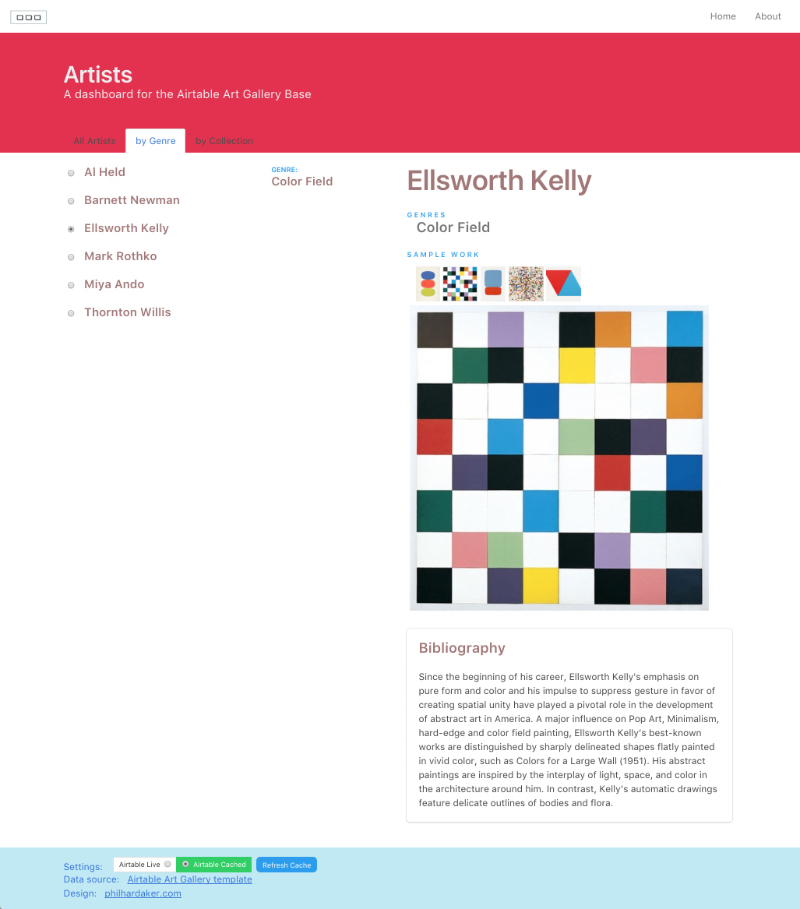

# Airpress Gallery

A dashboard for the Airtable Art Gallery Base.

This web application is a dashboard of a small Airtable database called Art Gallery.
Art Gallery is a built-in sample with only two tables. 
One table has a list of artists, their biographies, several photos of their 
work, and their genres. A second table groups the artists into collections of art movements.

## Features

* Python 3.6
* Flask Microframework with Jinja2 templates
* Bulma CSS Framework
* Zeptojs JQuery replacement
* Virtual environment for Python
* Python Airtable wrapper wrapper

## Installation

See installation and running notes at 
[PhilHardaker.com](https://www.philhardaker.com/projects/airtable_gallery/)

